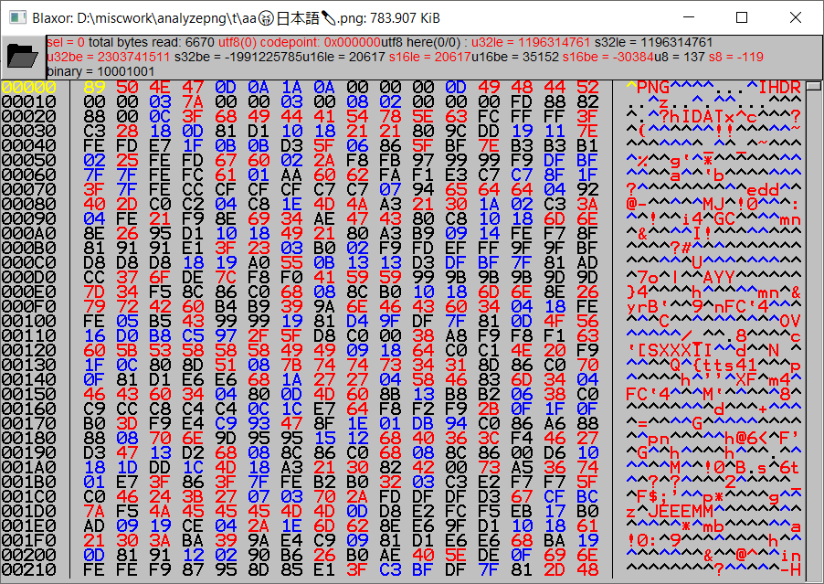
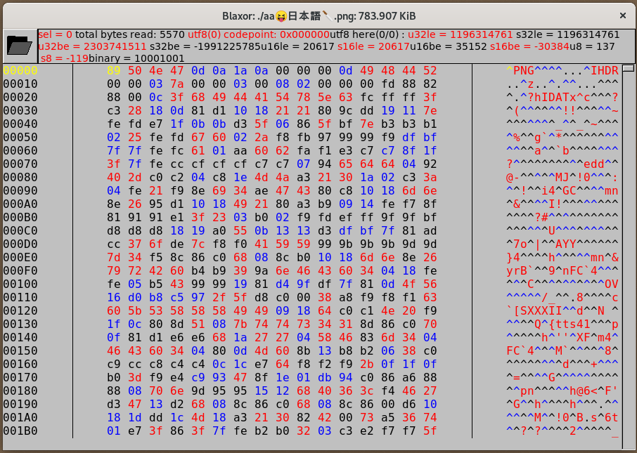

# Blaxor
A small hex viewer. Work in progress. Works on both Windows and Linux.
**I don't recommend using it yet unless you're up for a challenege.**
If you're interested but can't/don't want to build it or want to know all the
controls then let me know in an issue on here.

Uses:
1. [FLTK 1.3.5](https://www.fltk.org) (external dependency, not included in this repo).
2. [UTF-8 DFA decoder](http://bjoern.hoehrmann.de/utf-8/decoder/dfa/) (fully in `utf8dfa.hpp` and `utf8dfa.cpp`).

Written for fun, to get familiar with **FLTK** (a C++ GUI library I once saw
used in one game mod's config utility) and for my own use because it's hard
to find a simple, light, good and free hex viewer/editor. **Blaxor** is not an
editor yet (just a viewer) but it *might* be one in the future.

I use [XVI32](http://www.chmaas.handshake.de/delphi/freeware/xvi32/xvi32.htm)
and it's good and simple program but it has a few shortcomings I ran into too.
It doesn't seem to handle non-ASCII Unicode filenames (an error message with
garbled filename pops up), it's freeware but closed source, Windows only with a
license that forbids reverse engineering and modification. It also seems to
load entire file (or big part of it) into memory, taking seconds to load a few
GB file off of a HDD and for files starting at about 5 GB it'll just display an
error message about not being able to allocate memory (probably since it's a
32-bit program). I specifically avoid all these problems in **Blaxor**.

